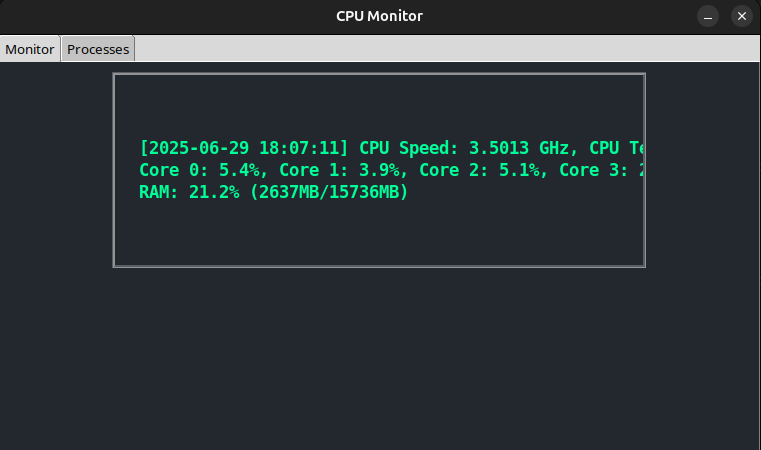
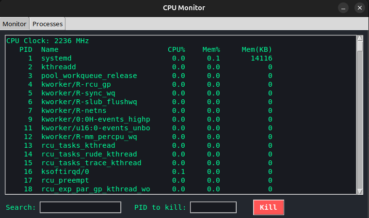

# CPU Monitor & Process Manager


A modern Python desktop widget for real-time system monitoring and process management.

## Features
- **Live CPU speed, temperature, per-core usage, and RAM usage** in a beautiful always-on-top window
- **Process Manager tab**:
  - Search running processes by name
  - View CPU%, memory%, and memory usage in KB
  - See the current CPU clock speed (system-wide)
  - Kill processes by PID
- **Logs** all status updates to `cpu_log.txt`
- **Dark theme** and easy-to-read fonts

## Requirements
- Python 3.7+
- [psutil](https://pypi.org/project/psutil/)
- [py-cpuinfo](https://pypi.org/project/py-cpuinfo/)
- Tkinter (usually included with Python, but may require `sudo apt install python3-tk` on Linux)

## Usage
1. Install dependencies:
   ```bash
   pip install psutil py-cpuinfo
   # On Ubuntu/Debian:
   sudo apt install python3-tk
   ```
2. Run the app:
   ```bash
   python start.py
   ```

## Notes
- Killing system or root processes may require running as administrator/root and is not recommended.
- CPU% is normalized so 100% means all CPU cores are fully used.
- The app is lightweight and safe to leave running in the background.

---

MIT License
